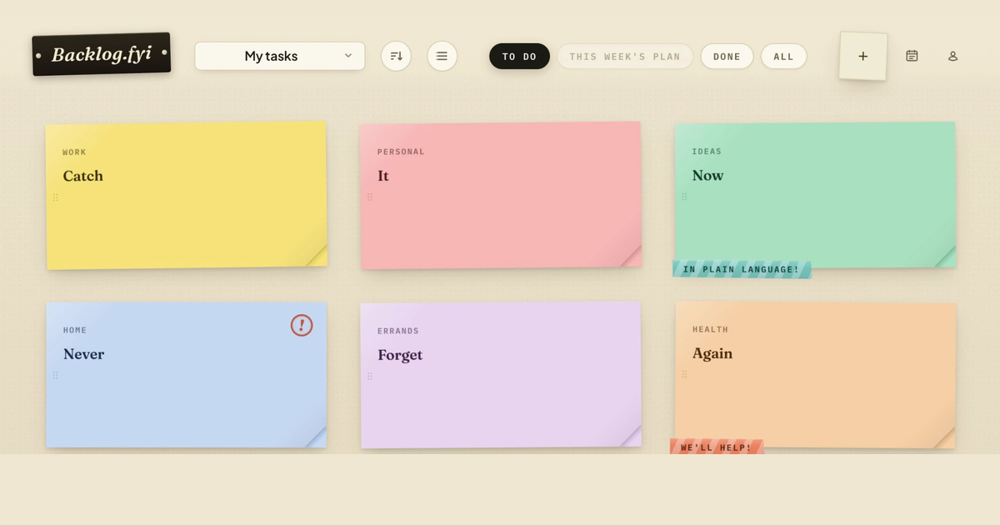

# Backlog.fyi
A personal tasks manager that helps you stay on top of things: save your tasks right when you 
think of them, big or small. Run a weekly planning session, and commit to your week. 

Hosted at **[backlog.fyi](https://backlog.fyi)** (free, in beta; there's a demo that needs no
sign-up). 



## Why

Two principles:

- **Capture is cheap.** A task should go into the backlog the moment you think of it, from the web
  app, a Telegram message, or a script, with no decisions attached.
- **Committing is the hard part.** Once a week you sit down with an assistant that sees the whole
  backlog and your week, and you negotiate a plan that fits. Whatever you agree to, goes out as
  calendar invitations, so it becomes real time in your week rather than another list.

## Features

- **Task board.** Tasks as sticky notes, with categories, tags, priority, deadline, estimated
  duration and recurrence ("every 6 months" brings the task back after it's done).
- **Weekly planning conversation**, on Telegram or in the web app. The assistant proposes a plan
  from your priorities, deadlines and stated preferences, you push back in plain language, and the
  agreed slots are emailed to you as calendar invitations. It remembers context across weeks.
- **Quick capture through Telegram.** Send the bot a message, a forwarded text, a photo of a
  notice or a voice note, and it comes back as a task draft you confirm with one tap. Fixed
  appointments become calendar events instead.
- **Reminders** on Telegram when a planned slot starts, with snooze and mark-done buttons.
- **Shared boards.** Share a board (groceries, school runs) and assign responsibilities while
  keeping your own boards private.
- **External API** with scoped tokens, for scripts, automations and AI assistants. It ships with an
  [OpenAPI description](https://backlog.fyi/external-api/openapi.yaml) and an
  [agent skill](https://backlog.fyi/external-api/SKILL.md). See
  [`docs/EXTERNAL-API.md`](docs/EXTERNAL-API.md).
- **Several ways to sign in:** Telegram, email magic link, or operator-listed usernames and
  passwords on a self-hosted instance. One account can have several.
- **Privacy:** email addresses, task contents and assistant messages are encrypted at rest. You
  can export your data or delete your account from the settings at any time.
- **Localized** web app, emails and bot: English, Hebrew, Russian and Arabic.

The AI features are optional, both per user and per instance; without them, it's a plain task
board. Reading your Google Calendar directly isn't built yet: the assistant plans from your
backlog and what you tell it, and the result reaches your calendar by email invitation.

## Self-hosting

Run your own instance with Docker Compose: the app, PostgreSQL and, optionally, Caddy for automatic
HTTPS. Every build of `main` is published as a container image (`ghcr.io/itaypk/taskboard`, amd64
and arm64). Telegram, email and the AI assistant (through [OpenRouter](https://openrouter.ai)) are
all optional; a private instance can sign in with a username and password.

```bash
git clone https://github.com/Itaypk/Taskboard.git
cd Taskboard/deploy
cp .env.example .env    # set the URL, domain, database password and encryption key
docker compose --profile proxy up -d
```

The guide is [`docs/SELF-HOSTING.md`](docs/SELF-HOSTING.md); every setting is listed in
[`docs/CONFIGURATION.md`](docs/CONFIGURATION.md).

## Development

Kotlin and Spring Boot 4 on JDK 25, with a React + TypeScript frontend that's bundled into the same
JAR. You need JDK 25 and Node 22; Docker only for the Postgres integration tests.

```bash
./gradlew bootRun    # builds the frontend too; in-memory H2, nothing else to set up
```

Then open `http://localhost:8080` and sign in with **Start now — no sign-up** (a sandbox account).
Commands, optional Telegram setup, the test layout and CI are in
[`docs/DEVELOPMENT.md`](docs/DEVELOPMENT.md).

Design notes live in [`docs/`](docs): start with [`SPEC.md`](docs/SPEC.md) (product intent),
[`PLANNING-FLOW.md`](docs/PLANNING-FLOW.md) and [`BOARD-MODEL.md`](docs/BOARD-MODEL.md).

## License

Copyright © 2026 Itay Polack-Gadassi.

Code: [GNU Affero General Public License v3.0 only](LICENSE) (`AGPL-3.0-only`). If you run a
modified version as a network service, the AGPL requires you to offer its users the corresponding
source.

Mascot artwork: [CC BY 4.0](LICENSES/CC-BY-4.0.txt). The "Backlog.fyi" name, logo and icons are
reserved: fine to keep when self-hosting (modified or not), but a public service needs its own logo
and icons and must not pose as the official one; see [`TRADEMARKS.md`](TRADEMARKS.md). Third-party
components (fonts, the disposable-domain list) and details: [`NOTICE.md`](NOTICE.md).

## Contributing

This is a solo project and pull requests are not accepted. Bug reports and ideas are welcome as
issues; see [`CONTRIBUTING.md`](CONTRIBUTING.md). Security problems go through GitHub's private
vulnerability reporting, not public issues.
